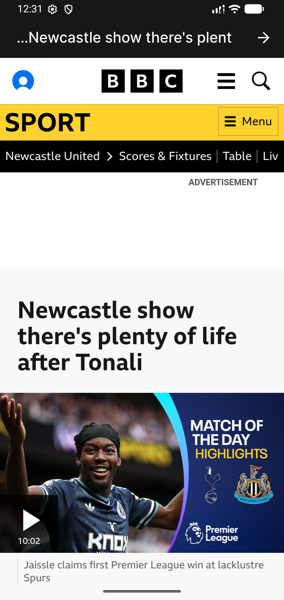
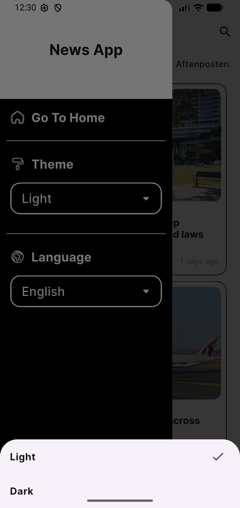

# News App 📰

A cross-platform news application built with Flutter, delivering real-time headlines, category browsing, and a smooth offline-first reading experience.

## Features

- 🔍 **Search** — find articles by keyword across sources
- 📂 **Category filtering** — browse news by category (tech, sports, business, etc.)
- 📴 **Offline-first caching** — read previously loaded articles without an internet connection
- 📄 **Pagination** — smooth infinite-scroll loading for article lists
- 🌐 **Localization** — supports multiple languages
- 🎨 **Theming** — light/dark mode support
- 🖼️ **Full-screen article view** — in-app web view for reading full articles
- ✨ **Custom splash screen**

## Architecture & Tech Stack

The app follows **Clean Architecture** with an **MVVM** structure:

- **Presentation (UI + ViewModel) Layer:** UI built with Flutter widgets, view logic handled via **Cubit** (from `flutter_bloc`). An alternative implementation of the UI layer using `FutureBuilder` was also explored on a separate branch for comparison.
- **Data Layer:** Repository pattern with separate remote and local data sources:
    - **Remote data source:** fetches news from the API
    - **Local data source:** caches data with **Hive** for offline-first support
    - **Repositories:** mediate between the data sources and the presentation layer

**State Management**
- [`flutter_bloc`](https://pub.dev/packages/flutter_bloc) (Cubit) — for news sources and news API data, in the main implementation
- [`provider`](https://pub.dev/packages/provider) — for theming and language/localization

**Networking**
- [`dio`](https://pub.dev/packages/dio) and [`http`](https://pub.dev/packages/http) — explored in different branches for API calls

**Local Storage / Caching**
- [`hive`](https://pub.dev/packages/hive)

**Dependency Injection**
- [`injectable`](https://pub.dev/packages/injectable) / [`get_it`](https://pub.dev/packages/get_it)

**API**
- [NewsAPI.org](https://newsapi.org)

## Getting Started

### Prerequisites
- [Flutter SDK](https://docs.flutter.dev/get-started/install) installed
- A free API key from [NewsAPI.org](https://newsapi.org)

### Installation

```bash
# Clone the repository
git clone https://github.com/Habi-ba/News-App-Flutter.git
cd News-App-Flutter

# Install dependencies
flutter pub get

# Add your NewsAPI key
# (update the relevant config/constants file with your API key)

# Run the app
flutter run
```

## Screenshots
| Home | Search | Article |
|:---:|:---:|:---:|
|  |  |  |
| Theme | Language | General |
|  |  |  |


## Author

**Habi-ba** — [GitHub](https://github.com/Habi-ba)